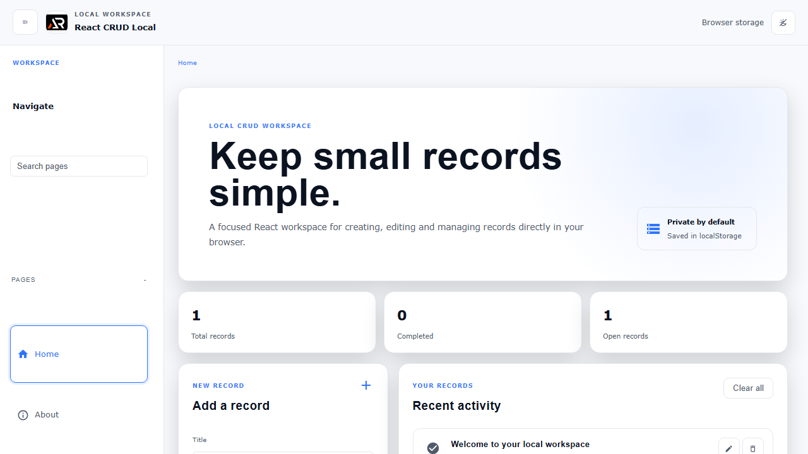

# React CRUD Local

A small React and Vite workspace for creating, editing, completing and deleting records in localStorage. It is frontend-only, so the data stays in the current browser.



## Features

- Local CRUD operations with browser persistence
- Light and dark themes
- Searchable navigation with Home and About routes
- Responsive layout with an accessible keyboard-friendly interface
- GitHub Pages deployment with a fresh project screenshot

## Tech stack

React, Vite, React Router, Material UI, styled-components and react-icons.

## Run locally

```bash
npm install
npm run dev
```

Build and preview:

```bash
npm run build
npm run preview
```

## Deployment

Live: [https://a2rp.github.io/react-crud-local/](https://a2rp.github.io/react-crud-local/)

## Links

- Portfolio: [https://www.ashishranjan.net/](https://www.ashishranjan.net/)
- GitHub: [https://github.com/a2rp](https://github.com/a2rp)
- CodePen: [https://codepen.io/ash1198](https://codepen.io/ash1198)
- LinkedIn: [https://www.linkedin.com/in/aashishranjan](https://www.linkedin.com/in/aashishranjan)
- Facebook: [https://www.facebook.com/theash.ashish/](https://www.facebook.com/theash.ashish/)
- YouTube: [https://www.youtube.com/@ashishranjan-ashz?sub_confirmation=1](https://www.youtube.com/@ashishranjan-ashz?sub_confirmation=1)
- Email: [ash.ranjan09@gmail.com](mailto:ash.ranjan09@gmail.com)

## Support

- Support: [https://a2rp-donation-page.netlify.app/](https://a2rp-donation-page.netlify.app/)
- Buy Me a Coffee: [https://buymeacoffee.com/a2rp](https://buymeacoffee.com/a2rp)
- Patreon: [https://patreon.com/a2rp](https://patreon.com/a2rp)
